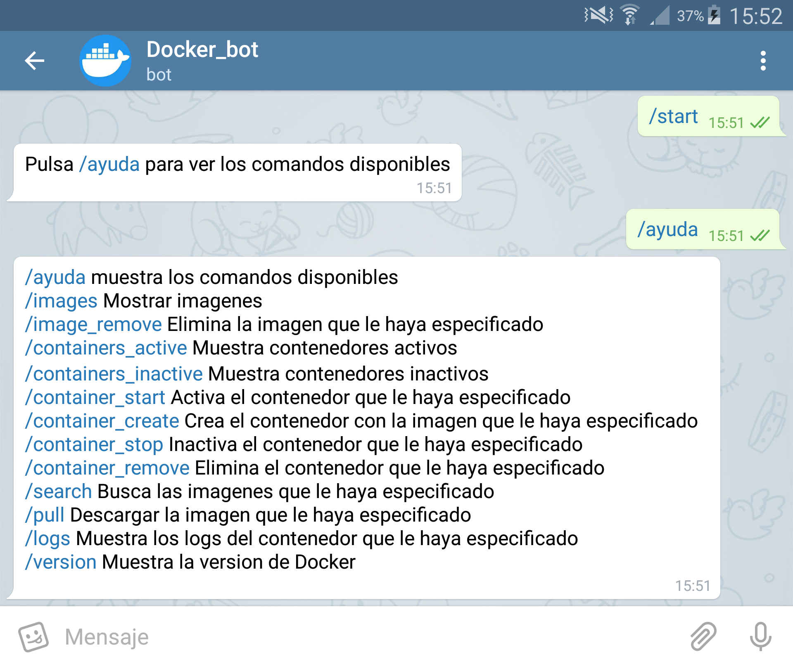

# docker-telegram-bot
Script en python que permite gestionar su servidor de Docker a través de un bot de telegram.

Bot de Telegram para gestionar su servidor de Docker.

<li><strong>ayuda</strong>: Comandos disponibles</li>
<li><strong>start</strong>: Arranca el bot</li>
<li><strong>images</strong>: Mostrar imagenes</li>
<li><strong>image_remove</strong>: Elimina la imagen que le haya especificado</li>
<li><strong>containers_active</strong>: Muestra contenedores activos</li>
<li><strong>containers_inactive</strong>: Muestra contenedores inactivos</li>
<li><strong>container_create</strong>: Crea el contenedor con la imagen que le haya especificado</li>
<li><strong>container_start</strong>: Activa el contenedor que le haya especificado</li>
<li><strong>container_stop</strong>: Inactiva el contenedor que le haya especificado</li>
<li><strong>container_remove</strong>: Elimina el contenedor que le haya especificado</li>
<li><strong>search</strong>: Busca las imagenes que le haya especificado</li>
<li><strong>pull</strong>: Descargar la imagen que le haya especificado</li>
<li><strong>logs</strong>: Muestra los logs del contenedor que le haya especificado</li>
<li><strong>version</strong>: Muestra la version de Docker</li>

